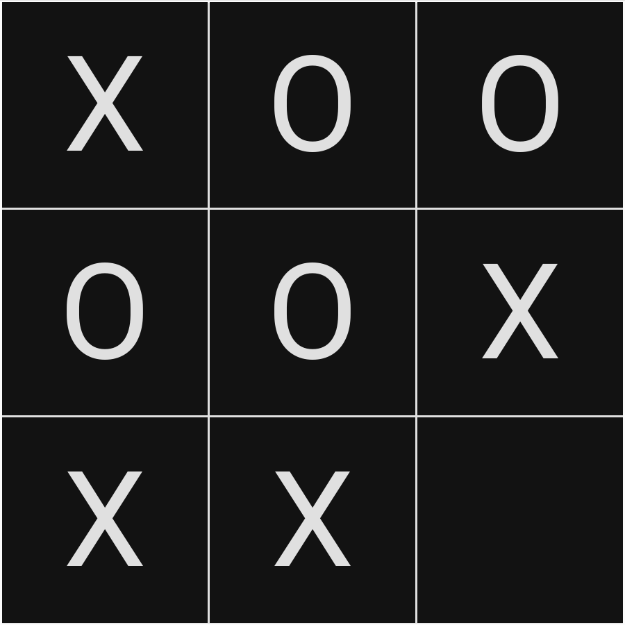

# Tic-Tac-Toe

 
This is my version of the Tic-Tac-Toe project for The Odin Project.

Check out the live demo of my <a href="https://thatblindgeye.github.io/tic-tac-toe/">Tic-Tac-Toe</a>.
 
 
## Features:
- Choose between a dark and light theme
- Play against another player or the computer
- Works on desktop and portable/mobile devices
- Able to play via keyboard only or mouse
 
 
## How to Play:
Even if you've never played tic-tac-toe before, it is a game that is as simple as can be.
Each player takes a turn picking a spot on the board to place their marker, X's for the 
first player and O's for the second player. You are unable to pick a spot that has already been marked.

The goal of the game is to get your mark 3 in a row either horizontally, vertically, or diagonally.

When you first open the webpage, choose either a 2 player (human vs human) or 1 player (vs computer) game. Then, enter the name(s) in the name field(s), or leave the field(s) blank for the default name(s). Then just click start and you'll be tic-tac-toeing!
 
 
